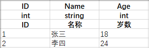
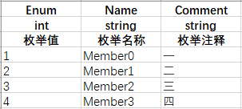
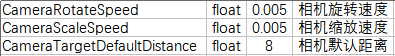

# Excel Translator

将 Excel 转换为数据和代码。

目前支持的数据格式：JSON；

目前支持的代码语言：C#；

运行参数如下：

| 参数缩写 | 参数全称       | 是否必须 | 默认值 | 注释                     |
| -------- | -------------- | -------- | ------ | ------------------------ |
| -e       | --excel        | true     |        | Excel 文件或目录的路径。 |
| -j       | --json         | true     |        | JSON 文件的生成路径。    |
| -c       | --csharp       | true     |        | C# 文件的生成路径。      |
| -C       | --class_prefix | false    |        | 数据类的前缀。           |
| -E       | --enum_prefix  | false    |        | 枚举类的前缀。           |
| -P       | --param_prefix | false    |        | 参数类的前缀。           |
| -n       | --namespace    | false    | Config | 命名空间。（仅用于C#）   |

## Excel 规范

Sheet 名称以"Ignore"为前缀，则不会生成数据及代码。

Sheet 名称以"Enum"为前缀，会被识别为枚举 Sheet，不生成数据，仅生成枚举类。

Sheet 名称以"Param"为前缀，会被识别为参数 Sheet，不生成数据，仅生成参数类。

### 数据 Sheet

Sheet 的第一行为该列数据的名称，仅可使用英文；生成代码时，会将该名称转换为 lowerCamel 风格，作为对应字段的名称；名称以"Ignore"为前缀，则不会生成该列对应的数据项及代码项。

Sheet 的第二行为该列数据的类型，目前支持 `bool, int, float, string, bool[], int[], float[], string[]`类型。

Sheet 的第三行为该列数据的注释，可以任意填写。

PS：当生成的数据格式为 JSON 时，会生成以第一列数据为键，所有合法数据为值的集合。因此第一列必须是主键。

生成代码时，会在 Sheet 名称前加上运行参数中的数据类前缀，作为对应数据类的名称。

| Sheet 名称 | 运行参数中的数据类前缀 | 最终生成的数据类的名称 |
| ---------- | ---------------------- | ---------------------- |
| Student    | C                      | CStudent               |

### 枚举 Sheet

Sheet 的第一列为枚举值，第二列为枚举名称，第三列为枚举注释，其余列不作处理。

生成代码时，会将 Sheet 名称的前缀"Enum"替换为运行参数中的枚举类前缀，作为对应枚举类的名称。

| Sheet 名称  | 运行参数中的枚举类前缀 | 最终生成的枚举类的名称 |
| ----------- | ---------------------- | ---------------------- |
| EnumStudent | E                      | EStudent               |

### 参数 Sheet

Sheet 的第一列为参数名，第二列为参数类型，第三列为参数值，第四列为注释，其余列不做处理。

生成代码时，会将 Sheet 名称的前缀"Param"替换为运行参数中的参数类前缀，作为对应参数类的名称。

| Sheet 名称    | 运行参数中的参数类前缀 | 最终生成的参数类的名称 |
| ------------- | ---------------------- | ---------------------- |
| ParamSettings | P                      | PSettings              |